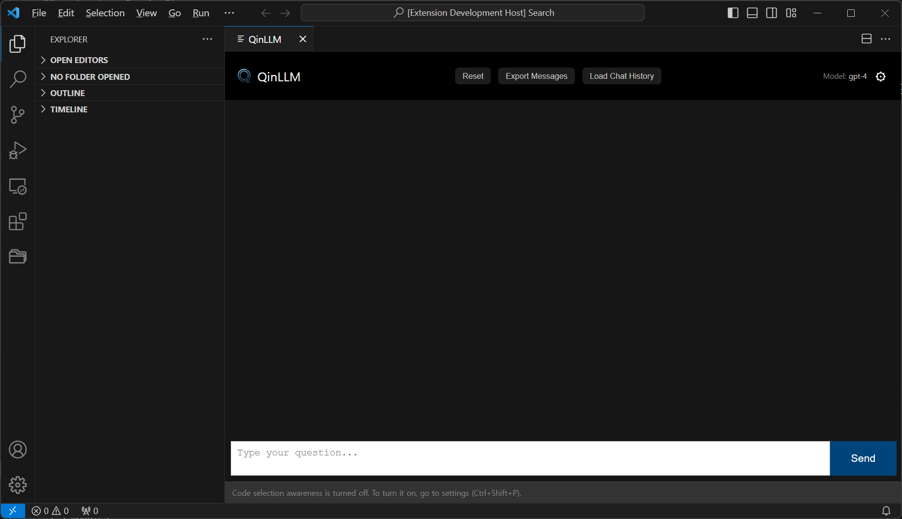

 

  

  This project began from 
  

    <b>QinIDE - AI assistant in your IDE</b> 
  Converse with <a href="https://ai.meta.com/llama/" target="_blank"> LLAMA2 </a> or <a href="https://openai.com/blog/openai-api" target="_blank">  OpenAI's ChatGPT</a> or <a href="https://console.anthropic.com/docs/api" target="_blank">Anthropic's Claude</a> in VSCode

  

## Build and run from source

1. Clone this repository and install the npm dependencies
2. Open the project in VS Code
3. Press `F5` to launch the extension in debug mode

## Bring Your Own API keys

To use ChatGPT / Claude in ChatIDE, you need to procure API Keys from OpenAI / Anthropic.
- **OpenAI**: https://openai.com/product#made-for-developers
- **Anthropic**: https://console.anthropic.com/docs/api

## Usage

1. Bring up ChatIDE with `Cmd + Shift + i` (or `Ctrl + Shift + i` on non-Apple platforms).
2. Choose your AI model. Currently supported: 
    - `'gpt-4'`, `'gpt-4-0613'`,`'gpt-3.5-turbo'`,`'gpt-3.5-turbo-16k'`  (OpenAI)
    - `'claude-v1.3'` (Anthropic)
4. On first usage, you'll be prompted to enter your API key for your chosen AI providers (will be stored in VSCode `secretStorage`).
5. Enjoy!

## Configuration

- Use the `Cmd + Shift + P` keychord and type `>Open ChatIDE Settings`
  - Choose your preferred `model`, `max_tokens`, and `temperature`.
  - Adjust the system prompt to your liking
  - Note: settings will auto save
- Run ChatIDE with `Cmd + Shift + i`. You'll be asked for your OpenAI / Anthropic API key on first time you use the model.
  - Note: your API keys will be stored in [VS Code's `secretStorage`](https://code.visualstudio.com/api/references/vscode-api#SecretStorage)

  

### Updating your API key

1. Run `cmd + shift + P` (or `ctrl + shift + P`)
2. Start typing `>ChatIDE`

#### OpenAI
3. Select `>Update your OpenAI API Key for ChatIDE`.

#### Anthropic
3. Select `>Update your Anthropic API Key for ChatIDE`.

## Known issues

1. There's currently no way to stop the model from generating. You need to wait until it's done.
2. Closing the ChatIDE pane while the model is generating might lead to a non-recoverable error. You'll need to restart VS Code to use ChatIDE again.

## Warning

⚠️ This is an early prototype, use at your own peril.

🧐 Remember to keep an eye on your OpenAI / Anthropic billing.

## Credits

ChatIDE continues to be built using ChatIDE.
